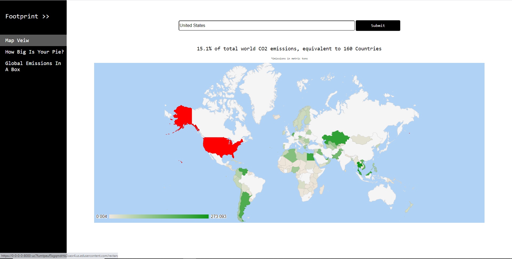

# Footprint
World Co2 emissions data visualization tool

# Description
This project finds and displays the longest combination of countries in which their total CO2 output equates to the user-given country. This is meant to show the impact that each country has on total world emissions.

